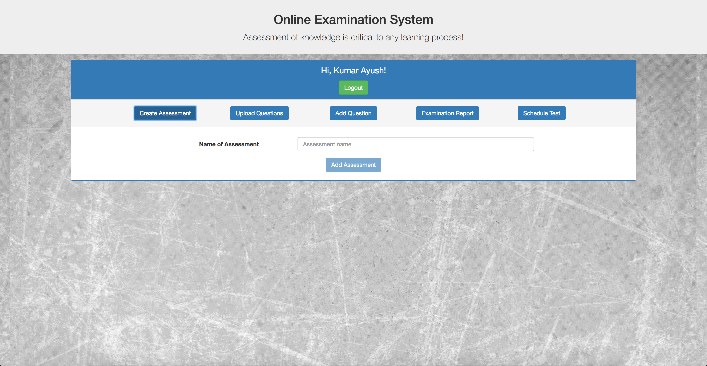
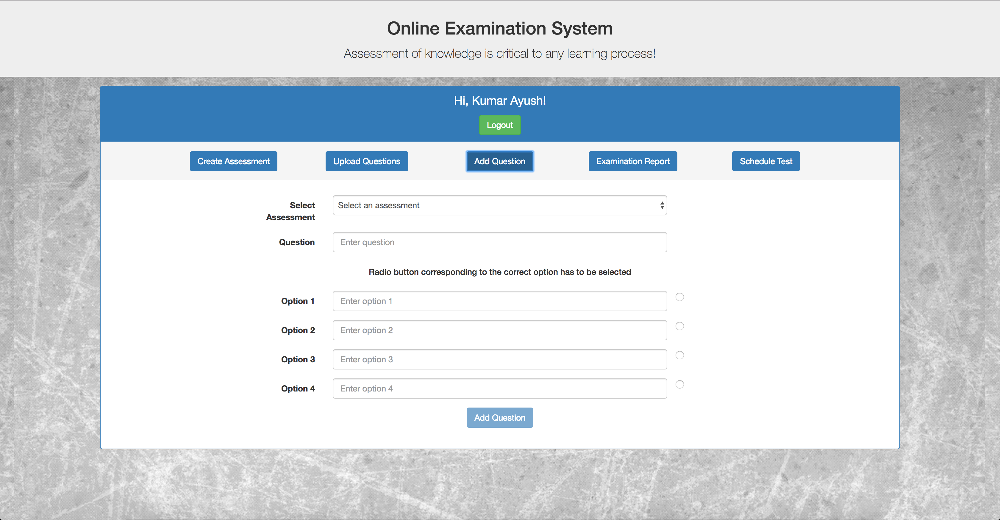
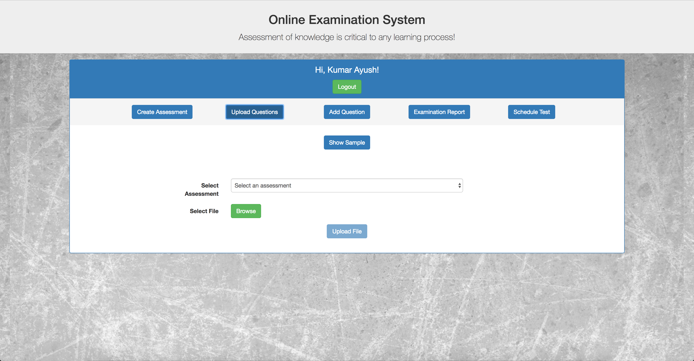
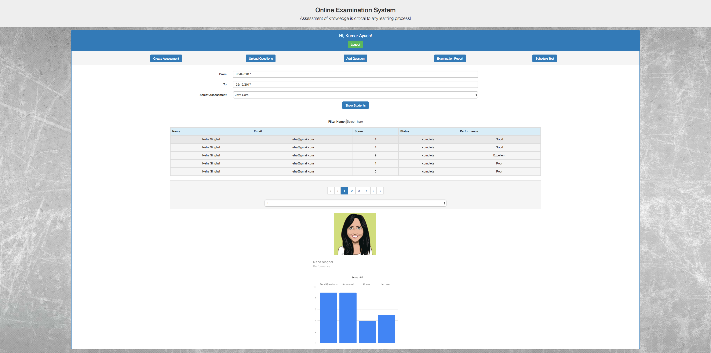
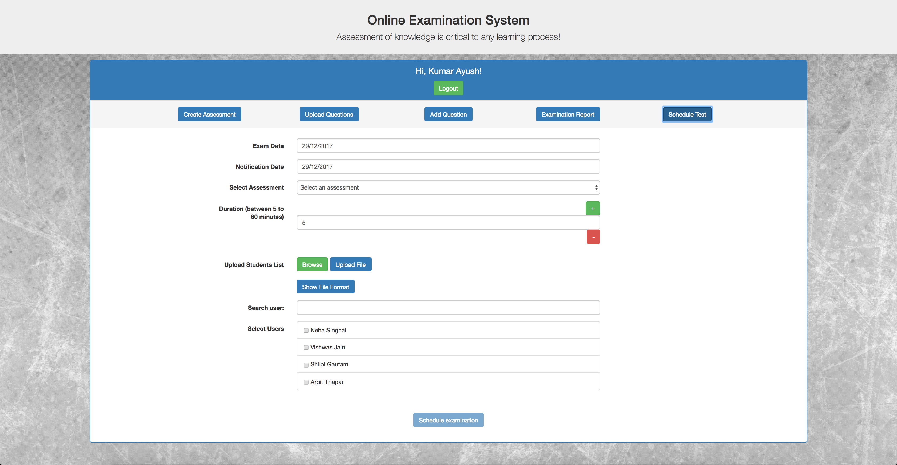

# Online Examination System (OES)
An online examination system made using Angular JS 1.x. 

## Taxonomy of OES
Users of OES are classified into two categories: Administrators and Students (Users). Administrators are responsible for management of system users, subjects, generating various result reports, system backup and recovery, etc. They are also responsible for preparing subjects, tests and questions. Students are the candidates appearing for the Examination.

How to Run
-------------------
* Clone the repository.

* Install JSON server:

  ```
  npm install -g json-server
  ```

* Running JSON server:
  ```
  json-server --static . --port 3000 --watch data.json
  ```

* Go to ```http://localhost:3000``` in your browser.


## Screenshots

### Sign In


### Admin
 
 


